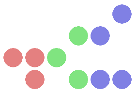

# Binary-Clock
A simple binary clock written in JavaScript using the HTML 5 canvas element.

Working example at [JSFiddle](https://jsfiddle.net/Gradox/Lg3v8jd0/).

Displays the time in the HH:MM:SS format.

\[Red: Hours, Green: Minutes, Blue: Seconds\]
